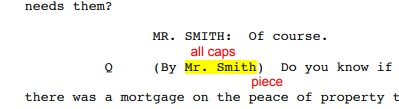
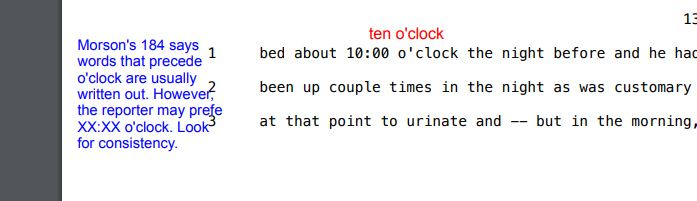
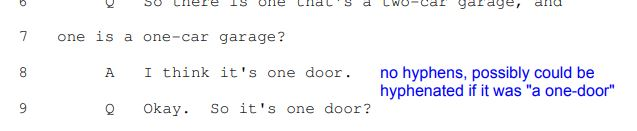

---
layout: page
title: Blue Pearls 2
---  

<h1>These are some of Caitlin's annotations taken from about PT #20 onwards:</h1>

 

  

  

  

  
  

  

  

  
  

  

  

  

  

  

  
  

  

  

  
  

  

  

  

  

  
  

  

  

  
  

  

  

  

  

  
  

  

  

  
  

  

  

  

  

  
  

  

  

  
  

  

  

  

  

  
  

  

  

  
  

  

  

  
