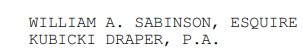
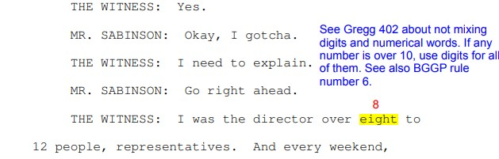

---
layout: page
title: test
---  

<h1>Grid Elements</h1>

A Grid Layout must have a parent element with the <em>display</em> property set to <em>grid</em> or <em>inline-grid</em>.

Direct child element(s) of the grid container automatically becomes grid items.

  

  

  

  
  

  

  

  
  

  

  

  
